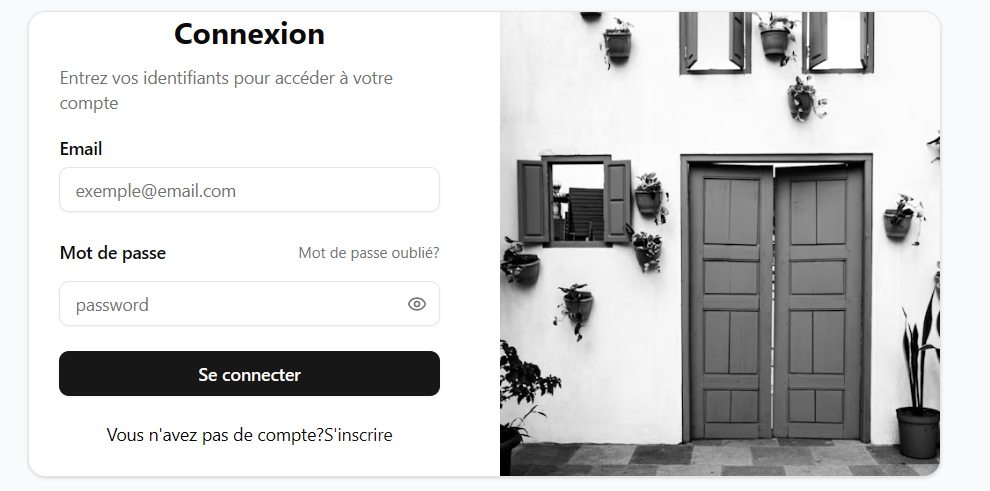
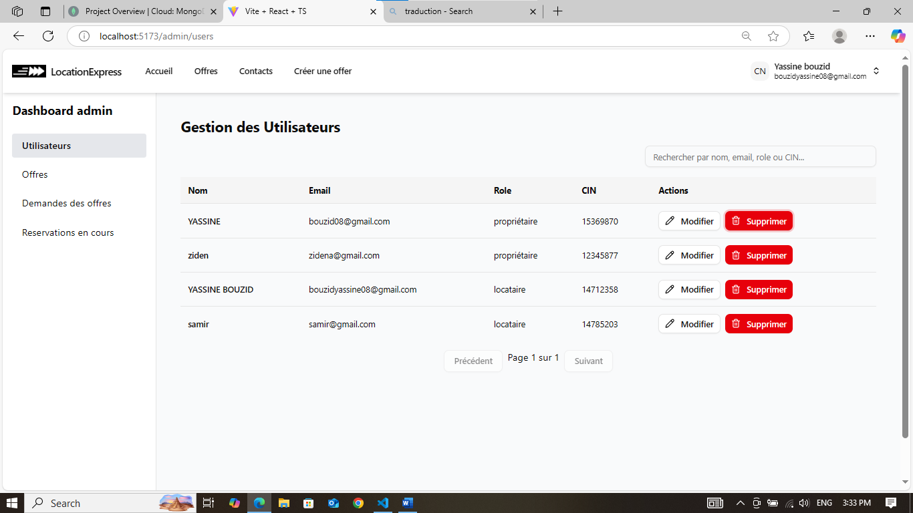
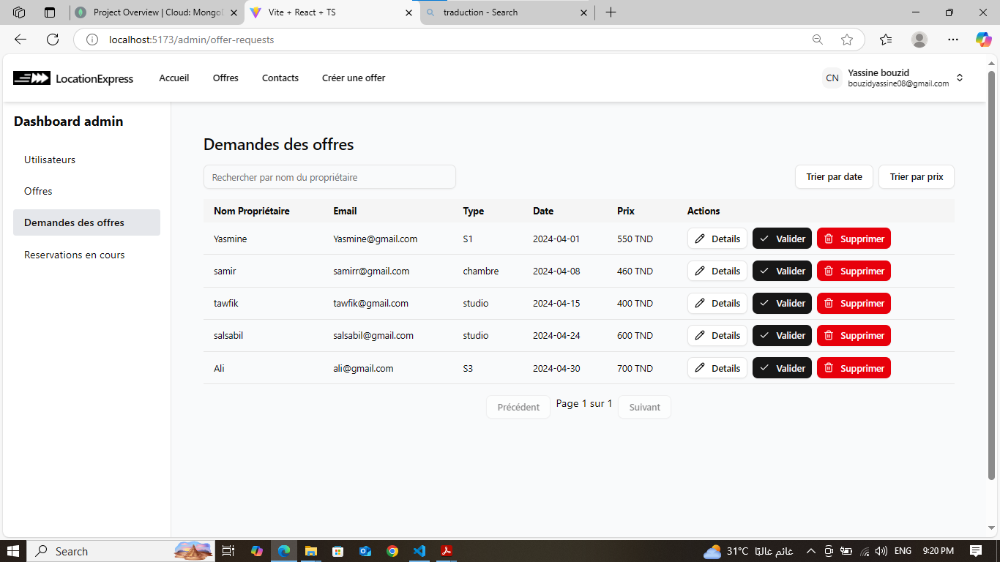
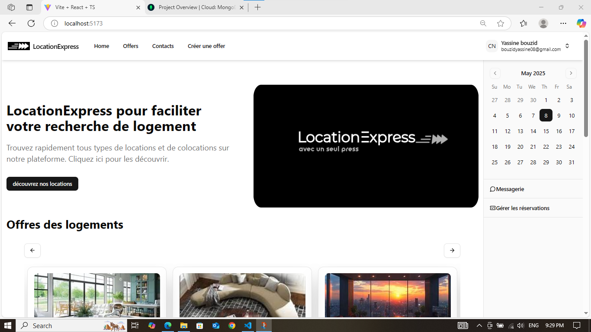
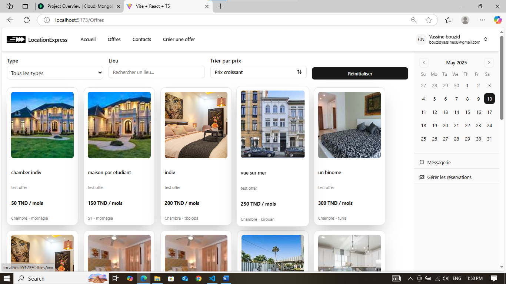
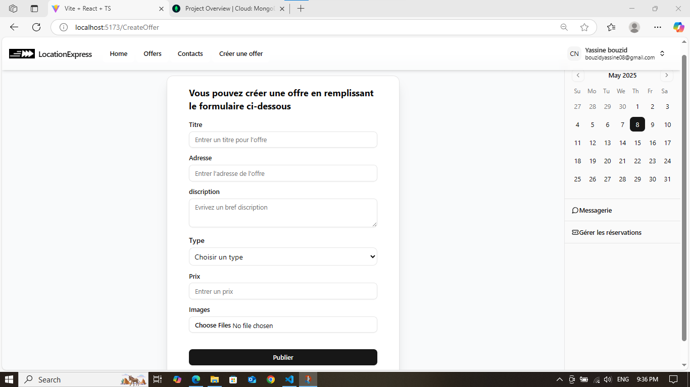
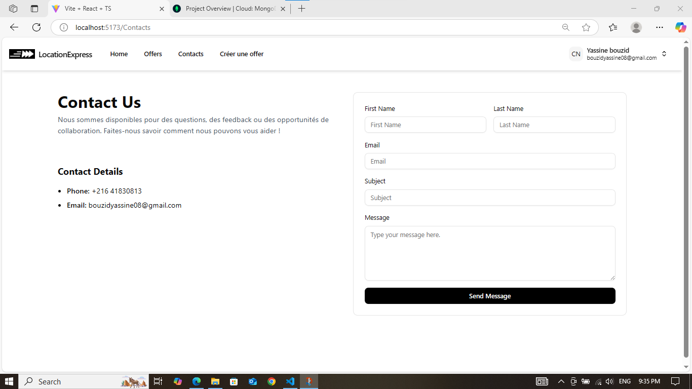
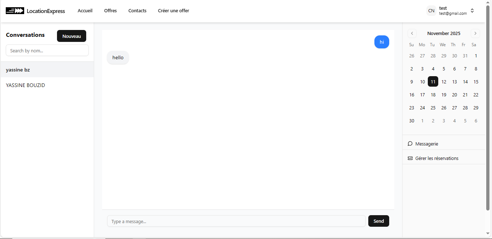

# LocationExpress - Application de location

Plateforme de location des appartements aide les personnes à cherché rapidement leur location desiré

## Fonctionnalités

- Authentification JWT (inscription, connexion, déconnexion)
- Middleware de sécurité :
  `hpp` Contre les requettes http pollué,
  `express-mongo-sanitize` Contre les injections SQL
- Gestion des données temps réel : `Socket.IO`
- Gestion des rôles : `admin`, `propriétaire`, `locataire`
- Notifié avec email les utilisateur à propos leur nouveau taches avec : `nodemailer`
- CRUD des offres
- Filtrage des offres
- Ajoute des offres
- Boite des messages
- Tableau de bord de gestion pour l'admin
- Tableau de bord de gestion des réservation pour proproétaire et locataire
- UI avec Tailwind CSS et Shadcn

---
## Installation

### 1. Cloner le dépôt

```bash
git clone https://github.com/yassinebouzid11/location-plateforme.git
cd location-plateforme
```

### 2. Backend

```bash
cd server
npm install
```

Créer un fichier `.env` directement sous le dossier server :

```
DATABASE_URI="Mettre ton mongodb_connection_string"
ACCESS_TOKEN_SECRET="Mettre un code secret"
PORT=5000
```


Puis :

```bash
npm run dev
```

### 3. Frontend

```bash
cd client
npm install
npm run dev
```


## Stack technique

- **Frontend** : React + Vite + Tailwind CSS + Shadcn
- **Backend** : Node.js + Express + MongoDB + Mongoose
- **Sécurité** : JWT, bcrypt, express-mongo-sanitize, hpp
- **communication temps réel** : Socket.IO

## Capture interface


















## Licence

MIT © 2025 [Yassine bouzid]